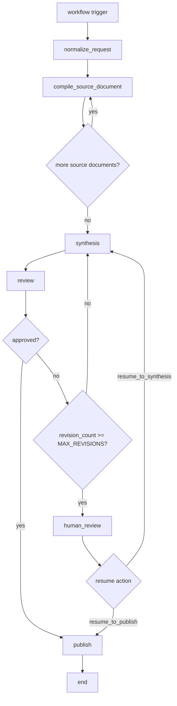

# waygate-workflows

`waygate-workflows` is the workflow runtime library for WayGate. It owns the
worker-side trigger router, the LangGraph compile workflow, the sequential
source-analysis loop, the compiled-artifact and human-review boundaries, and the helper
code that reconstructs prompt context from durable workflow state.

## What it owns

- Worker-side trigger handling through `process_workflow_trigger()`.
- Draft compile graph assembly through `compile_workflow()`.
- Source normalization and source-set identity derivation.
- Sequential source-analysis passes under supervisor-controlled specialist
  agents.
- Durable compile context including topics, tags, glossary entries, entity
  registry, claim ledger, reference index, and unresolved mentions.
- Synthesis, review retry, human-review interrupt, and compiled-artifact
   boundaries.
- Compiled-artifact rendering and human-review artifact generation.

## Runtime flow

1. `process_workflow_trigger()` validates an incoming `WorkflowTriggerMessage`.
2. The router builds a stable thread id and initial `DraftGraphState`.
3. `compile_workflow()` runs the LangGraph draft workflow with Postgres-backed
   checkpointing.
4. `normalize_compile_request()` reads raw documents, parses frontmatter, builds
   `document_order`, and derives `source_set_key`.
5. `compile_source_document()` runs one source-analysis pass at a time until all
   source documents have been processed.
6. `synthesize_draft()` produces the candidate markdown page.
7. `review_draft()` approves, rejects for retry, or escalates to human review.
8. `human_review_gate()` writes a review artifact and interrupts when retries
   are exhausted.
9. `publish_draft()` renders the approved compile artifact and writes it to the
   `compiled` namespace, then the router emits `ready.integrate`.

## Compile workflow diagram



The graph still uses the historical `publish` node name, but its current
behavior is to persist the approved compile artifact in `compiled/`, not to
write a final published document.

## Source-analysis loop

The compile workflow no longer uses the older broad per-document fan-out shape.
Instead, it processes source documents in a stable order so later passes can
reuse durable discoveries from earlier ones.

Each source-analysis pass reconstructs a bounded `DocumentAnalysisPromptContext`
containing:

- the active document
- relevant prior document briefs
- relevant canonical topics and tags
- relevant glossary and entity registry entries
- relevant claim and reference subsets
- relevant unresolved mentions
- optional storage-backed guidance loaded from the `agents` namespace

The current source-analysis supervisor coordinates four specialist roles:

- metadata extraction
- narrative summary
- grounded findings
- continuity inspection

When the supervisor model does not return a final structured response after
delegating to those tools, the runtime falls back to invoking the specialists
directly and combines their validated outputs deterministically. This keeps the
compile loop working with providers that can call tools but do not reliably
emit simultaneous tool-driven structured output.

## Durable state model

The main state container is `DraftGraphState` in
`libs/workflows/src/waygate_workflows/schema.py`.

Important durable fields include:

- `source_documents`, `document_order`, `document_cursor`, and `active_document`
- `source_set_key`
- `extracted_metadata` and `document_summaries`
- `prior_document_briefs`
- `canonical_topics` and `canonical_tags`
- `glossary`
- `entity_registry`
- `claim_ledger`
- `reference_index`
- `unresolved_mentions`
- `current_draft`, `review_feedback`, `review_outcome`, and compiled artifact
   fields

The compile node also performs cross-document continuity resolution. When a
later document introduces a matching term, entity, claim, or reference key,
older unresolved mentions can be moved from `open` to `resolved`.

## Public surface

### Router and entrypoints

- `process_workflow_trigger()` is the worker-facing entrypoint.
- `trigger_draft_workflow_from_message()` is the RQ-oriented adapter in
  `draft/jobs.py`.

### Graph assembly

- `compile_workflow()` compiles the LangGraph draft workflow.
- Node modules under `waygate_workflows.nodes` implement the deterministic graph
  boundaries.

### Agent layer

- `normalize_source_documents()` reads and normalizes raw documents.
- `analyze_source_document()` runs the source-analysis supervisor.
- `synthesize_draft_with_specialist()` produces the draft.
- `review_draft_with_specialist()` performs structured review.
- `render_publish_artifact()` builds the approved compiled markdown artifact.
- `build_human_review_record()` builds the persisted human-review artifact.

### Shared helpers

- `tools.source_analysis` provides the LangChain-callable specialist tools used
   by the document-analysis supervisor.
- `content.documents` parses source documents and derives `source_set_key`.
- `content.guidance` loads optional guidance text from the `agents`
   namespace.
- `content.publishing` projects workflow state into typed `DraftDocument` and `CompiledDocument` artifacts before rendering the compiled document with frontmatter.
- `runtime.llm` resolves provider-backed model invocations and worker startup
   preflight checks.
- `runtime.storage` resolves the active storage plugin.
- `runtime.checkpoint` builds the LangGraph Postgres checkpoint connection
   string.

## Trigger handling and outcomes

The worker router currently treats `draft.ready` as the implemented workflow
entrypoint.

- `draft.ready` runs the compile workflow.
- `ready.integrate` is accepted as a deferred follow-on trigger and currently
  returns `ignored` until the integration workflow is implemented.
- `cron.tick` is still ignored by the default workflow router.

The router returns one of four result shapes:

- `completed` with `compiled_document_uri`, `compiled_document_id`, and
   `compiled_document_hash`
- `human_review` with `human_review_record_uri` and interrupt payload
- `failed` with `error_kind = config` and `detail` when LLM provider
   configuration cannot satisfy a compile request
- `ignored` for unsupported event types

## Storage boundaries

The workflow uses storage namespaces as its durable system-of-record boundary.

- Raw source documents are read from the trigger-provided URIs.
- Human-review artifacts are written to the `review` namespace.
- Approved compile artifacts are written to the `compiled` namespace.
- Optional prompt guidance is read from the `agents` namespace.

## LLM Workflow Profiles

Workflow agents resolve models through the active provider plugin rather than
constructing provider SDK clients directly. For Ollama-backed runs, keep the
configuration layers separate:

- `WAYGATE_CORE__LLM_PLUGIN_NAME=OllamaProvider`
- `WAYGATE_OLLAMAPROVIDER__BASE_URL=http://localhost:11434`
- `WAYGATE_CORE__LLM_WORKFLOW_PROFILES='<json>'`

The preferred per-role tuning shape for compile is the JSON object below.
Legacy stage-model env vars such as `WAYGATE_CORE__METADATA_MODEL_NAME`,
`WAYGATE_CORE__DRAFT_MODEL_NAME`, and `WAYGATE_CORE__REVIEW_MODEL_NAME`
remain valid fallbacks.

The runtime validates every resolved LLM request before agent or stage
execution. In strict mode, unsupported common or provider-specific options
raise `LLMConfigurationError` instead of being silently dropped. Structured
output roles also fail fast when the active provider does not advertise
structured-output support.

For startup preflight, LLM-dependent worker roles can use the optional
`LLMReadinessProbe` companion contract when a provider implements it. When the
provider does not expose a dedicated readiness hook, the workflow layer falls
back to constructing the configured stage clients so startup still fails fast.

```json
{
   "compile": {
      "common_options": {
         "temperature": 0.1
      },
      "provider_options": {
         "OllamaProvider": {
            "num_ctx": 8192
         }
      },
      "option_policy": "strict"
   },
   "compile.source-analysis.metadata": {
      "model_name": "qwen3.5:9b",
      "common_options": {
         "temperature": 0.0
      },
      "provider_options": {
         "OllamaProvider": {
            "num_ctx": 4096
         }
      }
   },
   "compile.source-analysis.summary": {
      "model_name": "qwen3.5:9b",
      "common_options": {
         "temperature": 0.2
      },
      "provider_options": {
         "OllamaProvider": {
            "num_ctx": 8192
         }
      }
   },
   "compile.source-analysis.findings": {
      "model_name": "qwen3.5:9b",
      "common_options": {
         "temperature": 0.0
      },
      "provider_options": {
         "OllamaProvider": {
            "num_ctx": 8192
         }
      }
   },
   "compile.source-analysis.continuity": {
      "model_name": "qwen3.5:9b",
      "common_options": {
         "temperature": 0.0
      },
      "provider_options": {
         "OllamaProvider": {
            "num_ctx": 8192
         }
      }
   },
   "compile.source-analysis.supervisor": {
      "model_name": "qwen3.5:9b",
      "common_options": {
         "temperature": 0.1
      },
      "provider_options": {
         "OllamaProvider": {
            "num_ctx": 8192
         }
      }
   },
   "compile.synthesis": {
      "model_name": "qwen3.5:9b",
      "common_options": {
         "temperature": 0.4
      },
      "provider_options": {
         "OllamaProvider": {
            "num_ctx": 16384,
            "num_predict": 1200
         }
      }
   },
   "compile.review": {
      "model_name": "hermes3:8b",
      "common_options": {
         "temperature": 0.0
      },
      "provider_options": {
         "OllamaProvider": {
            "num_ctx": 8192
         }
      }
   }
}
```

When a compile run fails one of these preflight checks, the worker router now
returns a `failed` result with `error_kind = config` and the validation message
in `detail` instead of attempting a partial workflow run.

## Related files

- [libs/workflows/src/waygate_workflows/router.py](../../libs/workflows/src/waygate_workflows/router.py)
- [libs/workflows/src/waygate_workflows/workflows/compile.py](../../libs/workflows/src/waygate_workflows/workflows/compile.py)
- [libs/workflows/src/waygate_workflows/nodes/compile_source_document.py](../../libs/workflows/src/waygate_workflows/nodes/compile_source_document.py)
- [libs/workflows/src/waygate_workflows/schema.py](../../libs/workflows/src/waygate_workflows/schema.py)
- [docs/design/ingestion-and-workflows.md](../design/ingestion-and-workflows.md)
- [docs/design/compile-supervisor-multi-agent.md](../design/compile-supervisor-multi-agent.md)
